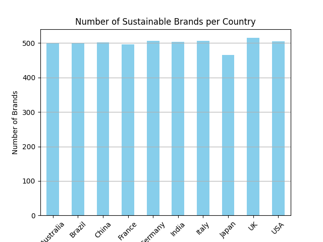
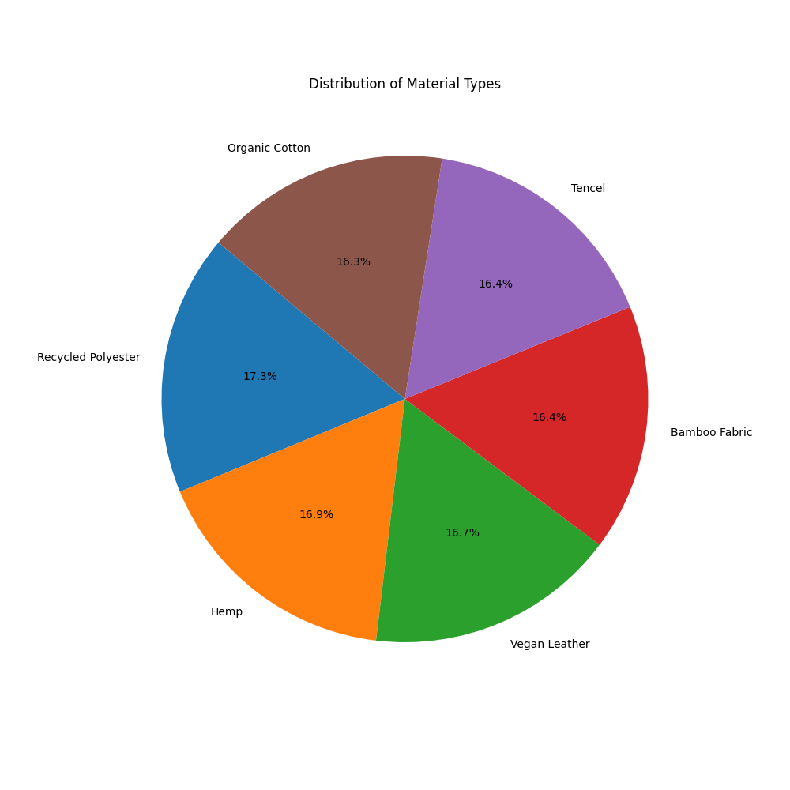

[](https://github.com/nogibjj/Nruta_Mini_Project_2/actions/workflows/lint.yml)
[](https://github.com/nogibjj/Nruta_Mini_Project_2/actions/workflows/format.yml)
[](https://github.com/nogibjj/Nruta_Mini_Project_2/actions/workflows/test.yml)
[](https://github.com/nogibjj/Nruta_Mini_Project_2/actions/workflows/install.yml)

# IDS 706 Week 2 Mini Project - Pandas Descriptive Statistics Script

### 🏗️ Requirements
- Python script using Pandas for descriptive statistics
- Read a dataset (CSV or Excel)
- Generate summary statistics (mean, median, standard deviation)
- Create at least one data visualization

### 📊 Dataset Description
The dataset used for this project is Sustainable Fashion: Eco-Friendly Trends from Kaggle. It provides information on sustainable fashion trends with various metrics related to the industry. For more details and to download the dataset, visit this [link](https://www.kaggle.com/datasets/waqi786/sustainable-fashion-eco-friendly-trends).

The dataset has the following features:
- Brand_ID
- Brand Name
- Country - country of origin
- Year - year the brand was created
- Sustainability_Rating - the rating of the brand - from A to D
- Material_type - the type of materials used
- Eco_Friendly_Materials - whether the materials were eco-friendly or not
- Carbon_Footprint_MT - the carbon footprint generated in metric tonnes
- Water_Usage_Liters - the amount of water used in liters
- Waste_Production_KG - the amount of waste produced in kilograms
- Recycling_Programs - whether the brand had any recycling programs or not
- Product_lines - number of product lines the brand had
- Average_Price_USD - the average price of a product by the brand, in US Dollars
- Market_Trend - checking the place of these brands as per the market
- Certifications - any certifications the brand had

### 🚀 How to Run
1. Clone the repository:

```bash
git clone https://github.com/nogibjj/Nruta_Mini_Project_2.git
cd Nruta_Mini_Project_2
```

2. Install the required dependencies:

```bash
pip install -r requirements.txt
```

3. Run the script:

```bash
python sustainable_fashion.py
```

3. Generate Markdown and visualizations:

- The output summary statistics will be saved in `sustainable_fashion.md`.
- Visualizations (bar chart and pie chart) will be saved as `bar_plot.png` and `pie_chart.png`.

### 📦 Installation
Make sure you have the latest version of Python installed. To install the necessary libraries:

```bash
pip install pandas matplotlib tabulate
```

### 🧪 Testing
You can run the script and test the output with the dataset provided. To check the correctness of the statistics and visualizations, run:

```bash
make test
```

### 📊 Output
After running the script, you will see:

- Summary statistics for numerical columns (mean, median, std deviation).
- Bar chart and pie chart visualizations saved in the root folder.

### 🔍 Visualizations
The script generates two visualizations:

1. Bar Chart - Displays the number of sustainable fashion brands by the countries.
2. Pie Chart - Shows the propotion of brands based on the materials they use.



The statistics and the visualizations for the Sustainability brands data can be viewed through the following link:
[Click here to view details](sustainable_fashion.md)